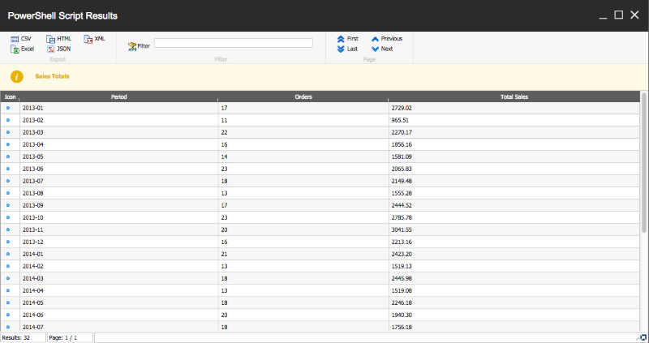
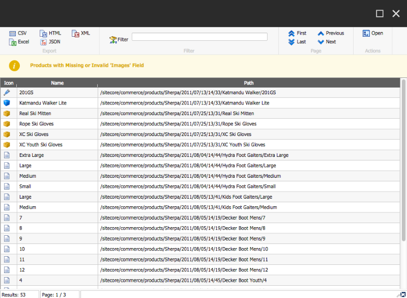
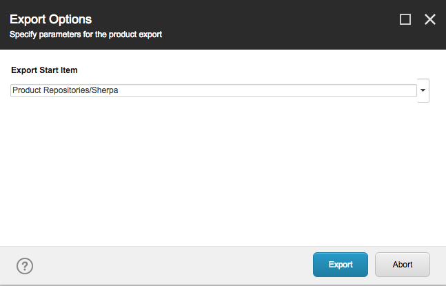
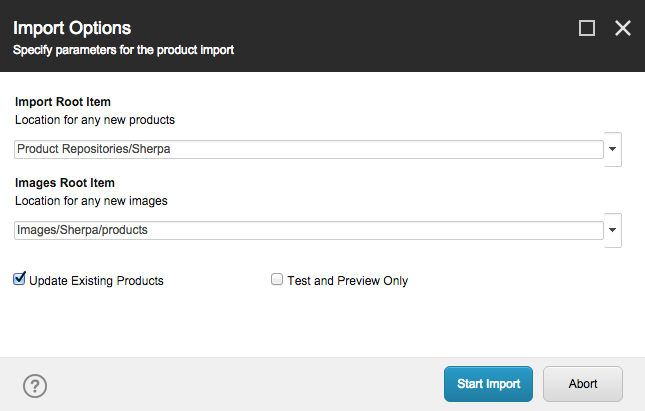

# Active Commerce PowerShell Extensions

This module provides some basic reports and utilities for Active Commerce, utilizing the popular and powerful [Sitecore PowerShell Extensions](https://marketplace.sitecore.net/Modules/Sitecore_PowerShell_console.aspx) (SPE) module. Included are some basic order reports, some basic product data quality reports, a basic product data CSV import/export tool, and some reusable PowerShell Cmdlets that make working with Active Commerce in SPE a little easier.

If you are not familiar with the SPE module, some good starting points include:

* [SPE on the Sitecore Marketplace](https://marketplace.sitecore.net/Modules/Sitecore_PowerShell_console.aspx)
* [Adam Najmanowicz's Sitecore PowerShell Resources](http://blog.najmanowicz.com/sitecore-powershell-console/)
* [Sitecore PowerShell Extensions Gitbook](http://sitecorepowershell.gitbooks.io/sitecore-powershell-extensions/content/)

We are open sourcing this module in order to make it available to Active Commerce customers and partners to utilize and extend. With a little PowerShell knowledge, SPE makes it easy to build custom reports and tools that make the day-to-day operations of your commerce site much smoother!

## Installing
* First, install Sitecore PowerShell Extensions from the Marketplace link above.
  * The current release has been tested with SPE 3.3 on Sitecore 7.1 and 8.1.
* Then, install this module's Sitecore package, found under [releases](http://www.github.com/ActiveCommerce/activecommerce-powershell-extensions/releases).

## Module Contents

### Order Reports

This module includes a few examples of generating order reports for Active Commerce by querying the Orders database using parameters collected from the user, doing additional data manipulation in PowerShell, and then outputting using the SPE *Show-ListView* cmdlet, which provides the ability to output data in a number of formats, including Excel, CSV, and HTML.

By default, these can be accessed via the Sitecore Desktop, Start > Reporting Tools > PowerShell Reports > Order Reports. Included reports are:

* *Orders* -- Report on individual orders, filtering by date and/or customer name.
* *Sales Totals* -- Aggregate order count and dollars by day, month, year, day of week, or month of year. Filter by date.
* *Product Sales Totals* -- Report on sales by product, including quantity sold and total revenue.



In order to query the NHibernate database, these reports utilize PowerShell LINQ cmdlets, described below.

### Product Data Quality Reports

Also included are a few examples of product data quality reports, which can be accessed from the context menu in the Content Editor within your product repository under Scripts > Reports. Again these reports allow you to output to various formats, but also allow you to quickly jump to items which the report finds.

Included reports are:

* *Hidden Products* -- Finds products which are flagged as hidden.
* *Products Missing Fields* -- Finds products which are missing a user-specified field.
* *Products with Validation Errors* -- Finds products with fields that fail the configured field validations.



### Product Data Export/Import

Limited product export/import functionality is also available in the module. These tools allow you to output product data to CSV, makes changes or add new products, and import the data back into your product repository. These tools can be accessed via the Sitecore Desktop, Start > PowerShell Toolbox > Porduct Export/Import.

You can use the tool of your choice for editing the CSV, though Google Sheets seem to work very well for bringing in and re-exporting CSV. The tool must support editing UTF-8. Excel on Mac does not support UTF-8 CSV files.

Supported import/export abilities:

* Export product data to CSV, and reimport in the same format.
* Choose where in the content tree you would like to start your export.
* Export and import any field in plain text format (raw values only).
* Special handling for the Price field, which expands into multiple columns for each shop / price level, and can be imported in the same format.
* Special handling for the Images field, which resolves images to/from their relative media library path.
* Ability to import new images into the media library for a product from http URLs. Simply add a new line to the Images cell for that product containing the URL.
* Ability to create new products on import by specifying an item name and template path (and other fields) on a new line in the CSV.
* Ability to specify the locations that new products and new images are created in the content tree.
* Ability to test/simulate imports.
* Reporting on (simulated) import results.

Currently not supported in this open source tool:

* Importing of new product variants.
* Product relationships, other than editing via raw values (pipe-delimited GUID).
* Single-line text list fields (Selling Points), other than editing via raw values (pipe-delimited strings).
* Lookup fields such as droplinks, multilists, and treelists, other than editing via raw values (pipe-delimited GUID).

Other ideas for enhancement:

* Allow the user to specify fields that should be included in the export.
* Provide option for emailed export and/or results of import, for large repositories.
* Ability to use rules or other mechanism for filtering output in export.
* Ability to specify path for new products individually, in the case that buckets are not being used.




### Active Commerce Cmdlets

To support the reports and tools included in this module, some PowerShell Cmdlets have been created that either simplify or make possible the desired functionality.

#### Get-AcSites

Gets a list of all the configured Active Commerce sites in the Sitecore instance. That is, those with an *EcommerceSiteSettings* attribute. The *-Dictionary* parameter outputs the sites as an ordered dictionary, which can be used with the *Read-Variable* cmdlet to allow a user to specify the site which should be used when running a report.

```
$result = Read-Variable -Parameters @{ Name="ShopContext"; Title="Shop Name"; Options=(Get-AcSites -Dictionary) }
```

#### Switch-AcShopContext

Functions the same as a *using* block with a *ShopContextSwitcher* in C# code. Specify the name of the shop site context via the *-Site* parameter. Optionally specify the database context with the *-Database* parameter (*master* is default). Use the *-ScriptBlock* parameter to provide the PowerShell script block that should be run within that shop context.

```
Switch-AcShopContext -Site $ShopContext -ScriptBlock {
    #do stuff
}
```

#### Resolve-AcObject

This cmdlet is a PowerShell shortcut for *Sitecore.Ecommerce.Context.Entity.Resolve().* Specify the type you wish to resolve from Unity, and optionally the name of the registration. Keep in mind the special syntax needed for working with generic types in PowerShell.

```
$orderManager = Resolve-AcObject ActiveCommerce.Orders.Management.IOrderManager``1[ActiveCommerce.Orders.Order]
```

#### PowerShell LINQ Cmdlets

When running reports on orders, performance is greatly helped by allowing NHibernate to execute SQL queries against the order database. In order to execute deferred LINQ queries in PowerShell, we need to do a little magic using the *System.Linq.Dynamic* library. The code for these cmdlets as well as documentation of the approach was found in the [LINQ Through PowerShell](http://bartdesmet.net/blogs/bart/archive/2008/06/07/linq-through-powershell.aspx) article on Bart De Smet's blog.

**Note:** There is an incompatibility between NHibernate's LINQ provider and the mechanism by which *System.Linq.Dynamic* constructs expression trees for anonymous objects in *GroupBy* statements. For this reason some of the included reports need to do additional grouping logic in PowerShell after an initial query.

## Building

Utilizing the items in this project currently requires [Team Development for Sitecore](http://www.hhogdev.com/products/team-development-for-sitecore/overview.aspx).

* Install a new Sitecore / Active Commerce instance, following directions in the *Installation Guide.*
* Install the appropriate Sitecore PowerShell Extensions module for your Sitecore version. Initial development/testing was done with version 3.3 on Sitecore 8.
* Before opening the solution, edit *src/deploy.targets* and specify the path to your Sitecore instance.
* Before opening the solution, edit *src/TdsGlobal.config* and specify the path and URL of your Sitecore instance.
* Open the solution and restore Nuget packages (may not be needed if you have Visual Studio configured to restore Nuget packages on build).
* Do a build. Do a deploy or synch to push the items in the TDS project to your Sitecore instance.